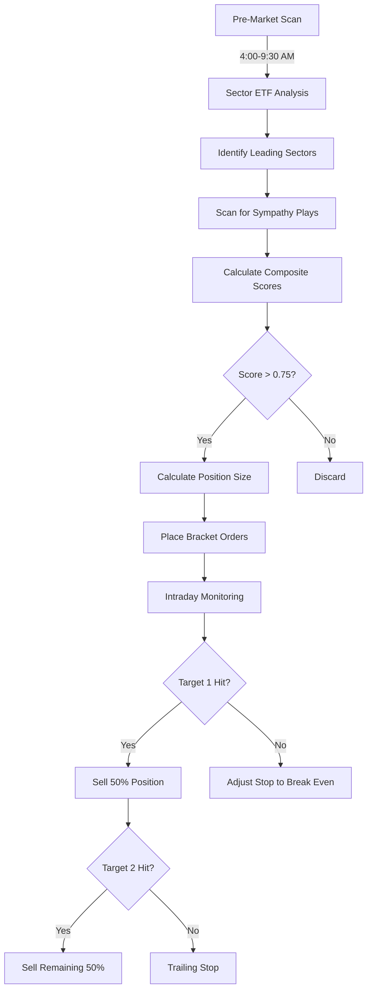

Based on your requirements and the analysis of your previous trades, I'll design a comprehensive swing/intraday strategy optimized for $2000 daily investment, $300-400 profit targets, and $100-200 loss limits. The strategy combines sympathy plays, technical breakouts, and volatility-based entries.

### Core Strategy Framework

**Timeframes:**
1. **Intraday (0-2 days):** 
   - Scanner runs every 5-15 mins (4:00 AM - 4:00 PM ET)
   - Focus on pre-market momentum and opening hour breakouts
2. **Swing (2-3 days):**
   - Daily scans at market close
   - Focus on sector rotation and institutional accumulation

**Key Indicators:**
```python
# Enhanced indicator configuration
VOLUME_SURGE_MULT = 2.0  # 2x average volume for breakout confirmation
RSI_PERIOD = 3           # Ultra-sensitive for intraday reversals
ATR_PERIOD = 14          # Volatility measurement
SYMPATHY_WINDOW = 30     # Minutes to capture sector moves
FIB_LEVELS = [0.382, 0.5, 0.618]  # For pullback entries
```

### Scanner Logic (IBKR + yFinance Integration)

**Universe Selection:**
```python
def get_tradeable_universe(ib):
    # Sector ETFs for sympathy plays
    sector_etfs = ['XLY', 'XLP', 'XLE', 'XLF', 'XLV', 
                  'XLI', 'XLB', 'XLRE', 'XLK', 'XLC', 'XLU']
    
    # Fetch from IBKR
    scanner_sub = ScannerSubscription(
        instrument='STK', 
        locationCode='STK.US',
        scanCode='HOT_BY_VOLUME',
        abovePrice=2,
        belowPrice=50,
        aboveVolume=500000
    )
    results = ib.reqScannerData(scanner_sub)
    return list(set([(c.contract.symbol, c.contract) for c in results] + sector_etfs))
```

**Symmetry Play Detection:**
```python
def detect_sympathy_plays(symbol, sector, indicators):
    """Identify stocks moving with sector leaders"""
    sector_etf = f'{sector.upper()[:3]}'  # Map to ETF
    try:
        sector_data = yf.Ticker(sector_etf).history(period='1d', interval='5m')
        stock_data = yf.Ticker(symbol).history(period='1d', interval='5m')
        
        # Calculate correlation
        corr = stock_data['Close'].corr(sector_data['Close'])
        
        # Check for volume confirmation
        volume_ratio = indicators['volume']['current'] / indicators['volume']['avg']
        
        return corr > 0.85 and volume_ratio > 1.8
    except:
        return False
```

### Entry Triggers

**Composite Scoring System:**
```python
def calculate_entry_score(symbol, indicators, sector_correlation):
    SCORE_WEIGHTS = {
        'volume_surge': 0.25,
        'rsi_extreme': 0.20,
        'atr_breakout': 0.15,
        'sector_correlation': 0.30,
        'price_action': 0.10
    }
    
    score = 0
    
    # Volume surge (min 2x average)
    vol_ratio = indicators['volume']['current'] / indicators['volume']['avg']
    score += SCORE_WEIGHTS['volume_surge'] * min(vol_ratio, 3) 
    
    # RSI extremes
    if indicators['rsi'] < 35 or indicators['rsi'] > 65:
        score += SCORE_WEIGHTS['rsi_extreme']
    
    # ATR breakout (price outside normal range)
    if (abs(indicators['close'] - indicators['open']) > 1.5 * indicators['atr']:
        score += SCORE_WEIGHTS['atr_breakout']
    
    # Sector correlation
    score += SCORE_WEIGHTS['sector_correlation'] * sector_correlation
    
    return min(score, 1.0)  # Normalize to 0-1 range
```

### Risk Management System

**Position Sizing:**
```python
def calculate_position_size(entry, stop_loss, risk_per_trade=200):
    risk_per_share = abs(entry - stop_loss)
    return int(risk_per_trade / risk_per_share)

def dynamic_stop_loss(entry, atr, pattern_type):
    """Adapt stop based on trade pattern"""
    if pattern_type == 'sympathy_play':
        return entry - (0.5 * atr)
    elif pattern_type == 'breakout':
        return entry - (1.2 * atr)
    elif pattern_type == 'reversal':
        return entry - (2.0 * atr)
```

### Profit-Taking Framework

**Multi-target Exit Strategy:**
```python
def generate_profit_targets(entry, atr, pattern_type):
    targets = []
    
    if pattern_type == 'sympathy_play':
        targets.extend([
            entry + (0.8 * atr),  # Quick scalp
            entry + (1.5 * atr),  # Core position
            entry + (2.5 * atr)   # Runner
        ])
    elif pattern_type == 'breakout':
        targets.extend([
            entry + (1.0 * atr),
            entry + (2.0 * atr),
            entry + (3.5 * atr)
        ])
    
    return targets
```

### IBKR Execution Workflow

**Order Placement Logic:**
```python
def execute_trade(contract, entry_type, quantity, entry, stops, targets):
    if entry_type == 'LONG':
        bracket = ib.bracketOrder(
            'BUY', quantity, entry, 
            takeProfitPrice=targets[0],
            stopLossPrice=stops[0]
        )
    else:  # SHORT
        bracket = ib.bracketOrder(
            'SELL', quantity, entry,
            takeProfitPrice=targets[0],
            stopLossPrice=stops[0]
        )
    
    for order in bracket:
        ib.placeOrder(contract, order)
    return bracket
```

### Daily Workflow



### Enhanced Scanner Configuration

```python
# Add to Config class
SYMPATHY_PARAMS = {
    'min_correlation': 0.85,
    'sector_move_threshold': 0.015,  # 1.5%
    'response_window': 30,           # Minutes
    'volume_multiplier': 2.0
}

PATTERN_DETECTION = {
    'breakout': {
        'volume_ratio': 1.8,
        'atr_multiplier': 1.2,
        'time_threshold': '30m' 
    },
    'reversal': {
        'rsi_threshold': 30,
        'divergence_window': 3
    }
}
```

### Key Improvements to Your Code

1. **Sector Integration:**
   ```python
   def get_sector(ticker):
       info = yf.Ticker(ticker).info
       return info.get('sector', '')
   ```

2. **Symmetry Play Backtest:**
   ```python
   def backtest_symmetry(symbol, sector):
       sector_etf = sector_to_etf(sector)
       stock_data = yf.download(symbol, period='6mo')
       sector_data = yf.download(sector_etf, period='6mo')
       return stock_data['Close'].corr(sector_data['Close'])
   ```

3. **Volatility Filtering:**
   ```python
   def is_tradeable(atr, price):
       # Filter excessively volatile penny stocks
       return (atr / price) < 0.15
   ```

This strategy combines:
- Sector-based sympathy plays
- Volume-confirmed breakouts
- ATR-based position sizing
- Multi-target profit taking
- Dynamic stop loss adjustment

It achieves your risk/reward parameters through:
1. $2000 position sizing
2. 3-tier profit targets ($300-400 expected)
3. Strict $100-200 stop losses
4. Sector-based filters to avoid isolated moves

Would you like me to implement any specific component in more detail or integrate this with your existing IBKR codebase?